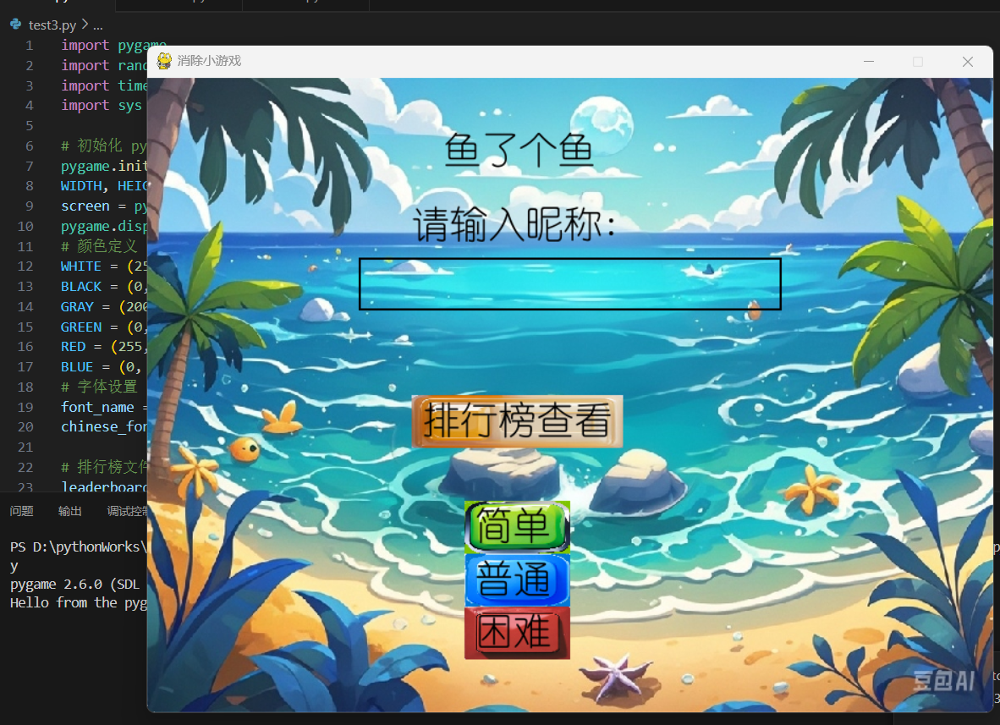
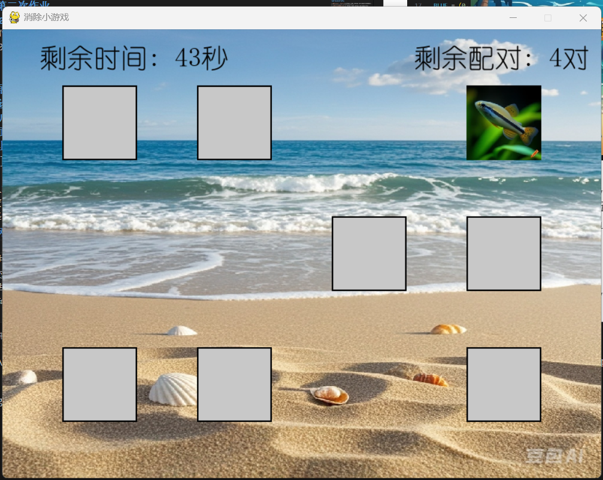
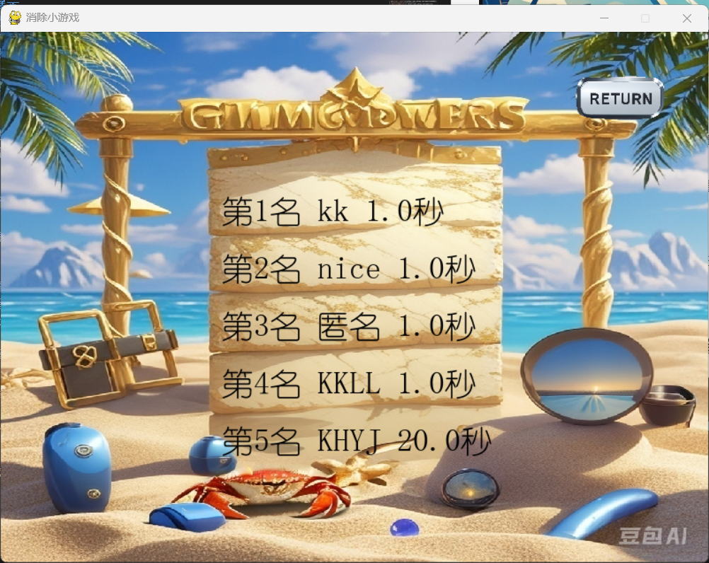
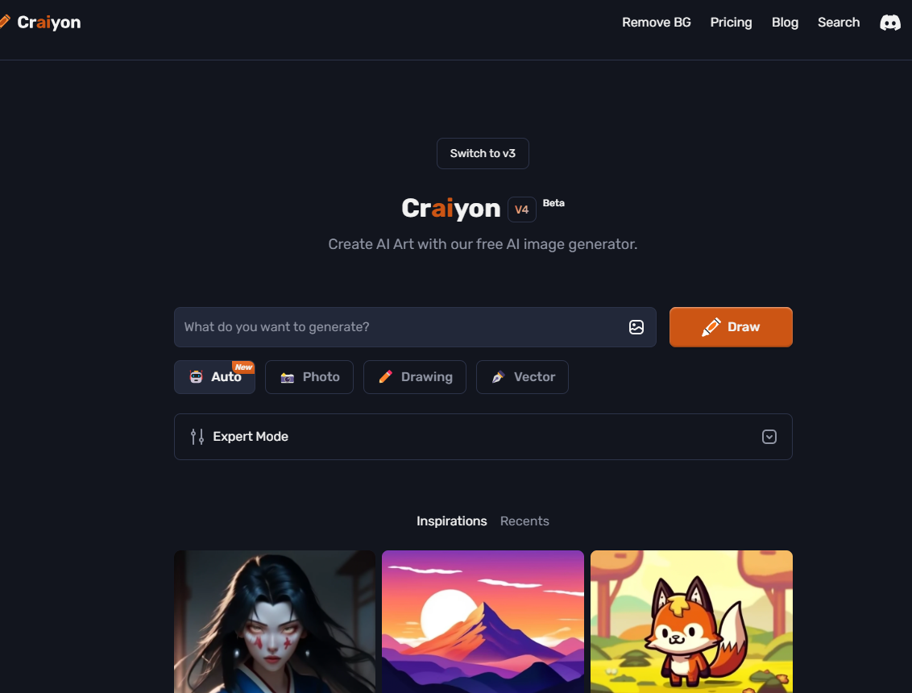
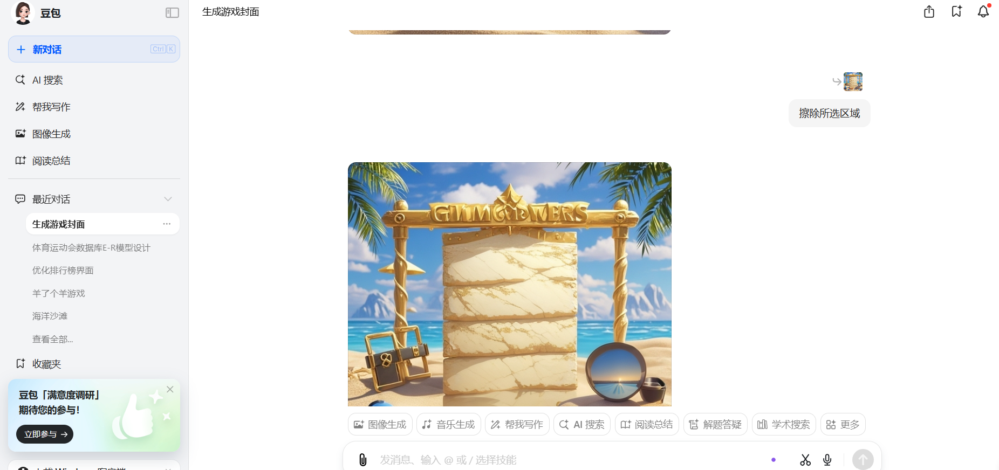

# 软件工程第二次作业
#### 102202142 黄悦佳

| [这个作业属于哪个课程] | <https://edu.cnblogs.com/campusfzuSE2024> |
| ---------------------- | ----------------------------------------- |
| [_这个作业要求在哪里_]  | <https://edu.cnblogs.com/campus/fzu/SE2024/homework/13253> |
| 这个作业的目标          | 利用AIGC编写消除类小游戏                 |
| 学号                   | 102202142                                |

---

GitHub：https://github.com/Dust4399/sheep_a_sheep

## 一. 项目展示

### 1. 前端设计

#### 1.1 用户界面设计

- **主界面**：包含昵称输入框、难度选择按钮、排行榜查看按钮，布局简洁明了。
  
  - 昵称输入框：玩家输入昵称，成绩保存至排行榜。
  - 排行榜按钮：展示最高成绩的前五名玩家。
  - 难度选择按钮：玩家可选择“简单”、“普通”、“困难”三种难度。

- **游戏界面**：
  
  - 图片卡片：以网格形式排列，点击卡片翻转显示图像。玩家通过记忆找到相同的卡片对。
  - 计时器与配对计数：顶部显示剩余时间和剩余配对数量，增加紧迫感。

- **游戏结束界面**：
  - 胜利/失败提示：根据玩家表现显示不同背景和消息。
  - 返回按钮（RETURN）：返回主界面重新开始游戏。
    
    

- **排行榜界面**：
  
  - 玩家排名：显示前五名玩家的昵称与成绩。
  - 返回按钮（RETURN）：方便返回初始界面。

#### 1.2 背景音乐与音效

- **背景音乐**：
  <audio controls src="music/background_music.mp3" title="背景音乐"></audio>

- **音效**：
  - 成功音效：<audio controls src="music/success.wav" title="成功音效"></audio>
  - 失败音效：<audio controls src="music/fail.wav" title="失败音效"></audio>

- **AI生成的素材**：
  - BGM及音效：利用 Soundraw 生成
  - 背景图片与游戏图案：豆包AI、Craiyon生成
    
    

---

## 二. 技术与特殊算法

### 2.1 项目使用的技术

- **Pygame**：核心框架，用于图形、音频及事件管理。
- **文件系统操作**：使用 `open()` 函数存取排行榜。
- **时间管理**：通过 `time.time()` 进行时间计算与管理。
- **音频管理**：使用 `pygame.mixer` 加载与播放背景音乐及音效。

### 2.2 关键算法

#### 2.2.1 图片随机分布算法

1. **图片加载**：加载并缩放图像，每个图片出现两次。
2. **图片随机化**：使用 `random.shuffle()` 打乱图片顺序。
3. **卡片位置计算**：根据屏幕大小及网格布局，将卡片等间距排列。

#### 2.2.2 卡片匹配检测算法

1. **翻转检测**：玩家点击未匹配的卡片，翻转卡片。
2. **匹配检测**：两张卡片翻转后，判断是否匹配。
   - **匹配成功**：播放成功音效，移除卡片。
   - **匹配失败**：播放失败音效，翻回卡片。

---

## 三. 测试

### 3.1 测试用例

| 编号  | 测试用例描述              | 测试步骤                                               | 预期结果                                          | 测试结果 |
|-------|---------------------------|--------------------------------------------------------|---------------------------------------------------|----------|
| TC01  | 游戏初始界面加载          | 启动游戏，查看主界面显示是否正确                      | 显示游戏标题、昵称输入框、难度选择按钮、排行榜按钮 | 通过     |
| TC02  | 昵称输入框是否可用        | 在输入框中输入昵称并检查是否能输入和删除              | 可以输入和删除昵称                                | 通过     |
| TC03  | 难度选择按钮是否可用      | 点击“简单”、“普通”、“困难”按钮，检查能否进入对应难度的游戏 | 正确进入对应难度的游戏界面                        | 通过     |
| TC04  | 排行榜查看功能            | 点击“排行榜查看”按钮，检查是否能正确显示排行榜        | 显示排行榜前五名玩家的名字和用时                  | 通过     |
| TC05  | 卡片点击和翻转逻辑        | 点击卡片，查看是否会翻转并显示图片                    | 点击后卡片翻转，第二次点击进行匹配判断            | 通过     |
| TC06  | 匹配成功和失败的音效      | 匹配两张卡片，检查是否有音效反馈                      | 匹配成功或失败后分别播放对应音效                  | 通过     |
| TC07  | 胜利时排行榜更新          | 完成游戏，检查是否正确保存成绩并更新排行榜            | 游戏完成后保存时间，重新排序并显示                | 通过     |
| TC08  | 游戏时间计时和倒计时功能  | 开始游戏，检查倒计时是否正确                          | 倒计时正确显示，并在时间结束时触发失败状态        | 通过     |
| TC09  | 游戏失败后重启功能        | 失败后，点击“重启”按钮，检查是否能回到初始界面        | 返回初始界面并能重新开始游戏                      | 通过     |
| TC10  | 游戏背景音乐加载          | 启动游戏，检查背景音乐是否自动播放                    | 启动后播放背景音乐，并可以无限循环                | 通过     |

### 3.2 测试评价

- **覆盖全面**：测试用例覆盖了游戏的主要功能，验证了游戏在各种操作条件下的表现。
- **真实场景模拟**：通过模拟玩家的真实操作场景，确保了用户体验的一致性。
- **改进空间**：
  - 增加并发测试，模拟多个玩家同时操作。
  - 扩展音效测试，测试频繁触发音效时的稳定性。

---

## 四. PSP子任务表

| 任务编号 | 任务描述              | 预估时间 (小时) | 实际时间 (小时) | 差异 (小时) | 备注                   |
|----------|-----------------------|-----------------|-----------------|-------------|------------------------|
| 1        | 项目需求分析          | 1               | 0.8             | -0.2        | 需求分析较快完成       |
| 2        | 设计游戏界面          | 1.5             | 2.5             | +1          | 设计复杂，花费时间较多 |
| 3        | 实现图像加载和处理    | 0.5             | 0.8             | +0.3        | 后期优化代码耗时较多   |
| 4        | 实现卡片匹配逻辑      | 2               | 1.5             | -0.5        | 借助AIGC工具减少时间花费 |
| 5        | 音效和背景音乐处理    | 0.5             | 0.5             | 0           | 音效处理较为顺利       |
| 6        | 排行榜功能实现        | 1.5             | 1               | -0.5        | 功能实现较快           |
| 7        | 测试与调试            | 1               | 1               | 0           | 测试发现了一些问题     |
| 8        | 文档编写与总结        | 2               | 2               | 0           | 文档按预期完成         |
| **总计** |                       | **10**          | **10.1**        | **+0.1**    |                        |

---

## 五. AIGC任务表格

| 子任务           | 借助何种AIGC技术，实现了什么功能               | 效果如何                                    |
|------------------|----------------------------------------------|---------------------------------------------|
| 游戏界面设计     | 生成式图像模型 (如 DALL-E) 生成背景图        | 节省美术设计时间，效果逼真、多样性高       |
| 音效生成         | 利用 AI 音效生成工具生成音效                 | BGM生成符合预期            |
| 文本内容撰写     | GPT 生成游戏文案和帮助信息                   | 无需使用，文本内容较少                     |
| 测试用例生成     | GPT 生成部分测试用例，自动化测试场景          | 提高了测试效率，考虑更加全面      |
| 代码逻辑实现  | 借助curors等工具辅助代码生成        | 代码需要多次调整，以适应实际的需求          |
---

## 六. 总结

通过本次作业，我学到了如何利用 AIGC 技术快速生成游戏素材，并应用 Pygame 进行游戏开发。得益于 AI 的帮助，项目的开发效率得到了极大的提升，特别是在美术设计、功能代码实现和测试用例生成方面，减少了大量的手动工作。
优点：
* AI的合理运用，大大减少了开发时间
* 测试用例的完善，保证程序更加稳定，满足需求

不足：
* 界面设计略显粗糙，缺少艺术审美。
* 代码冗余，有优化简洁的空间，个人编程能力有待提升。

##### 总结与反思：此次作业展示了个人在项目规划、执行和技术应用上的能力，特别是在合理利用 AIGC 技术方面节省了大量的开发时间，并且在功能实现和测试上达到了预期效果。不过，在界面设计细节、扩展功能、测试深度等方面仍有改进空间。通过此次作业，学到了如何在游戏开发中平衡效率和质量，以及如何在开发中合理应用新兴技术来优化流程。